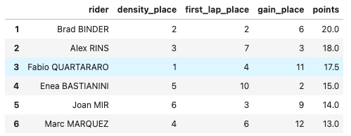
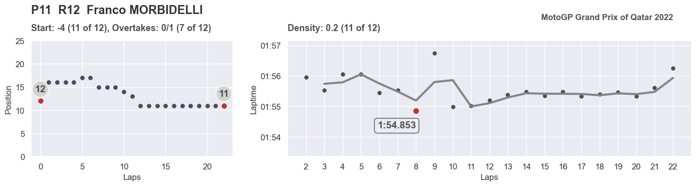
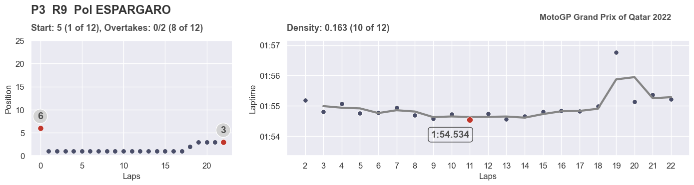
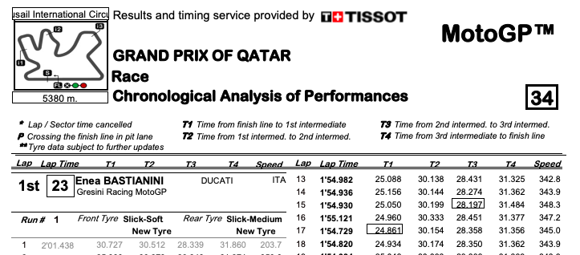

## Методика оценки результатов чемпионата по мотогонкам MotoGP

**Стек:** Python, Numpy, Pandas, Selenium, Difflib, Seaborn, pyPDF, PyMyPDF

#### Постановка задачи

Ключевая проблема оценки выступления пилотов любых гоночных серий (за исключением моно-серий) - отсутствие объективных данных об уровне техники (гоночного болида, мотоцикла, и тд.). К примеру, гонщик может показать отличное выступление, но при этом занять последнее место из-за того, что его мотоцикл гораздо медленнее конкурентов. Чтобы отделить эффект быстрого мотоцикла от реального уровня выступления гонщика, разработана методика, опирающаяся на данные гоночных протоколов.

Система должна быть максимально автоматизированной на всех этапах проекта - от сбора данных с сайта организатора гонок до формирования итоговых отчетов.

#### Описание методики

В гоночных протоколах доступны следующие данные: 
- время прохождения каждого круга для каждого пилота;
- позиции пилотов на старте гонки;
- позиции пилотов на трассе в течение каждого круга по ходу гонки.

Так как данных для работы не так много, принято решение отталкиваться от времени прохождения круга, то есть создать на его основании ключевой показатель, и затем дополнить его второстепенными коэффициентами.

Ключевая гипотеза состоит в том, что гонщик, показывающий более плавные времена круга, демонстрирует более качественное выступление. Более плавные в данном случае означает, что время прохождения каждого последующего круга не сильно отличается от времени предыдущего. В качестве "идеального" графика для каждого гонщика используется **скользящее среднее** (окно в 2 круга). Дополнительно учитываются коэффициенты за обгоны по ходу гонки и хороший старт. 

На выходе алгоритм предлагает таблиц у с рейтингом топ-12 финишировавших. 

**density_place** - место пилота за плавность времен круга.  
**first_lap_place** - место пилота за действия на старте и первом круге.  
**gain_place** - место пилота за обгоны по ходу гонки.  

К примеру, в этой таблице лучший гонщик - Brad Binder. Он занял 2 место из 12 по плавности прохождения круга, 2 место из 12 по действиям на старте, 6 место из 12 по обгонам в течение гонки. Это позволило ему набрать в общей сумме 20 баллов, что является наивысшим показателем.

Дополнительно можно отобразить результаты для каждого пилота. Здесь показаны изменение позиции пилота по ходу заезда и график времен с указанием лучшего круга.

#### Описание работы алгоритма

- протокол с результатами гонки автоматически скачивается с сайта MotoGP в формате .pdf (скачивание осуществляется с помощью навигации и выбора нужного раздела сайта через меню);
- данные извлекаются из .pdf в виде списка, состоящего их большого числа строк и переформатируются в Pandas DataFrames;
- считаются итоговые метрики и строятся графики.

#### Исходные данные 
Протокол результатов гран-при в формате .pdf скачивается с сайта www.motogp.com)

#### Выгруженные сырые данные

Пример выгруженных данных. В выгрузке присутствует "мусор": сдвоенные строки, разделенные строки, лишние пробелы и символы. Для каждого гран-при эти дефекты индивидуальны, поэтому задача алгоритма - это не просто удалить лишние строки, зная их индекс, а научиться распознавать необходимую информацию (времена на круге, имена пилотов и команд) среди "мусора", удаляя лишнее.

#### Преобразованные данные

#### *Дополнительно: Более детальное описание предпосылок, которое будет интересно тем, кто увлекается мотоспортом*

*Гипотеза о ключевом значении плавности изменения времен круга основана на нескольких предпосылках.*

*Во-первых, в гоночной среде известно, что наиболее ценны пилоты, способные выдавать стабильные времена на круге. Это связано с тем, что инженерам в этом случае гораздо проще обрабатывать данные об изменении состоянии мотоцикла и шин, чтобы вносить изменения в настройки. Но эта предпосылка касается скорее с выступлениями на тестах и свободных практиках.*

*Во-вторых, большое отклонение в двух соседних временах круга в гонке обычно свидетельствует об ошибке пилота. Ошибка приводит с одной стороны к чистой потере времени, с другой - ошибка часто связана с перетормаживанием, выездом на грязную часть гоночного полотна, выездом за пределы гоночного полотна, что приводит к дополнительным потерям времени из-за охлаждения, загрязнения или разрушения шин.*

*В-третьих, косвенно, если ошибка или недочет допущены во время обгонов других участников, и в итоге не приводит к опережению соперника, то это говорит о неумении пилота грамотно рассчитывать силы и состояние мотоцикла - своего и соперника. Учесть этот момент помогает дополнительный параметр, отслеживающие динамику изменения положения илота по ходу гонки.*