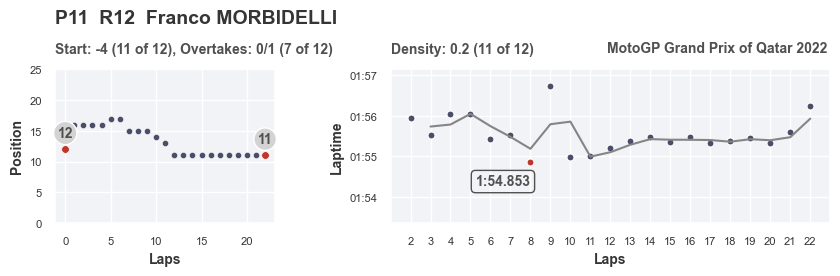

## Методика оценки чемпионата по мотогонкам MotoGP

#### Постановка задачи

Ключевая проблема оценки выступления пилотов любых гоночных серий (за исключением моно-серий) - отсутствие объективных данных об уровне техники (гоночного болида, мотоцикла, и тд.). К примеру, гонщик может демонстрировать отличные выступления, но при этом финишировать последним просто потому, что технически его мотоцикл значительно уступает конкурентам. "На глаз" оценить эффект, который вносит быстрая или медленная техника, довольно проблематично.

Методика, опирающаяся на статистические данные, позволит более объективно оценивать выступления пилотов и исключить эффект, не зависящий от их профессиональных навыков.

Система должна быть максимально автоматизированной на всех этапах проекта - от сбора данных с сайта организатора гонок до формирования итоговых отчетов.

#### Описание методики

В гоночных протоколах, публикуемых на официальном сайте MotoGP, доступны следующие данные: 
- время прохождения каждого круга для всех пилотов;
- позиции пилотов на старте гонки;
- позиции пилотов на трассе в течение каждого круга по ходу гонки.

Данных для работы не так много. Теоретически, наиболее интересной характеристикой здесь является время прохождения круга. Именно поэтому основная задача - это найти способ преобразовать обычное время прохождения круга в некий ключевой показатель эффективности, и затем дополнить его вспомогательными коэффициентами.  

Ключевая гипотеза, которая поможет решить эту задачу, следующая: гонщик, показывающий более плавные времена круга, демонстрирует более качественное выступление. "Более плавные" в данном случае означает, что время прохождения каждого последующего круга не сильно отличается от времени предыдущего. В качестве "идеального" графика для каждого гонщика используется **скользящее среднее** (окно в 2 круга), а в качестве показателя эффективности - среднее абсолютное отклонение от этого "идеала". 

Дополнительно учитываются коэффициенты за хороший старт и обгоны по ходу гонки. 

На выходе алгоритм предлагает таблицу с рейтингом для пилотов, финишировавших на первых 12 местах. 

**density_place** - рейтинг пилота за плавность времен круга.  
**first_lap_place** - рейтинг пилота за действия на старте и первом круге.  
**gain_place** - рейтинг пилота за обгоны по ходу гонки.  

К примеру, в этой таблице лучший гонщик - Brad Binder. Он занял 2 место из 12 по плавности прохождения круга, 2 место из 12 по действиям на старте, 6 место из 12 по обгонам в течение гонки. Это позволило ему набрать в общей сумме 20 баллов, что является наивысшим показателем.

Дополнительно можно визуализировать результаты для каждого пилота. На графике ниже показаны изменения позиции пилота по ходу заезда (график слева) и времена на круге по ходу гонки (график справа). Серая линия - скользящее среднее или "идеальный" темп, а точки - реальные времена на круге. Например, для **Franco MORBIDELLI** можно отметить следующее: в начале гонки темп рваный  и непоследовательный; на 8 круге поставлено лучшее время гонки (красная точка) - видимо, к этому моменту гонщику удалось приспособиться к состоянию трассы и шин, и начиная с 10 круга темп очень ровный, отклонения крайне невелики, явных ошибок нет, заметно только ухудшение темпа на последнем, 22 круге. Также можно отметить, что после очень быстрого времени на 8 круге сразу же последовала ошибка и заметнен явный выброс на 9 круге. 

#### Описание работы алгоритма

- протокол с результатами гонки автоматически скачивается с сайта MotoGP в формате .pdf (скачивание осуществляется с помощью навигации и выбора нужного раздела сайта через меню);
- данные извлекаются из .pdf в виде списка, состоящего их большого числа строк и переформатируются в Pandas DataFrames;
- считаются итоговые метрики и строятся графики.

#### Исходные данные 
Протокол результатов гран-при в формате .pdf скачивается с сайта www.motogp.com.

#### Выгруженные сырые данные

Пример выгруженных данных. В выгрузке присутствует "мусор": сдвоенные строки, разделенные строки, лишние пробелы и символы. Для каждого гран-при эти дефекты индивидуальны, поэтому задача алгоритма - это не просто удалить лишние строки, зная их индекс, а научиться распознавать необходимую информацию (времена на круге, имена пилотов и команд) среди "мусора", удаляя лишнее.

#### Преобразованные данные

#### Теоретическое обоснование

Более детальное описание предпосылок ключевой гипотезы, которое будет интересно тем, кто увлекается мотоспортом.

*Гипотеза о важности плавности изменения времен круга основана на нескольких предпосылках.*

*Во-первых, в гоночной среде известно, что наиболее ценны пилоты, способные выдавать стабильные времена на круге. Это связано с тем, что в этом случае инженерам гораздо проще обрабатывать данные об изменении состоянии мотоцикла и шин, чтобы вносить изменения в настройки и улучшать мотоцикл по ходу гоночного уик-энда. Но эта предпосылка касается скорее с выступлениями на тестах и в свободных практиках.*

*Во-вторых, большое отклонение в двух соседних временах круга в гонке обычно свидетельствует об ошибке пилота. Ошибка приводит с одной стороны к чистой потере времени, с другой - ошибка часто связана с перетормаживанием, выездом на грязную часть гоночного полотна, выездом за пределы гоночного полотна, что приводит к дополнительным потерям времени из-за охлаждения, загрязнения или разрушения шин.*

*В-третьих, косвенно, если ошибка или недочет допущены во время обгонов других участников, и в итоге не приводит к опережению соперника, то это говорит о неумении пилота грамотно рассчитывать силы и состояние мотоцикла - своего и соперника. Учесть этот момент помогает дополнительный параметр, отслеживающие динамику изменения положения илота по ходу гонки.*